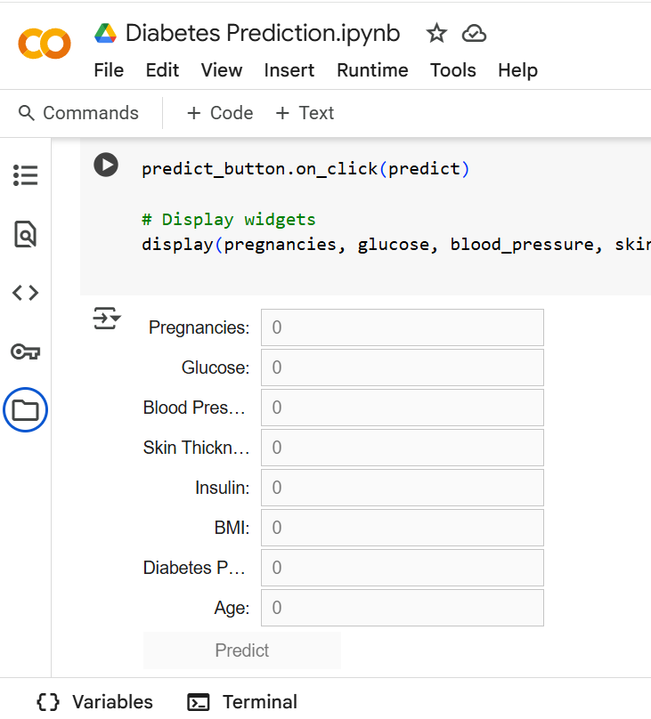

<h1 align="center">🩺 Diabetes Prediction Tool</h1>

  
  
  

---

## 📑 Table of Contents

- [📝 Project Overview](#project-overview)
- [🖼️ Demo](#demo)
- [🚀 Features](#features)
- [🛠️ Technologies Used](#technologies-used)
- [📊 Dataset](#dataset)
- [🔍 Data Preprocessing](#data-preprocessing)
- [🧠 Model Training & Evaluation](#model-training-and-evaluation)
- [💻 User Interface (GUI)](#user-interface-gui)
- [🧪 Testing & Results](#testing-and-results)
- [🚧 Challenges](#challenges)
- [🛣️ Future Improvements](#future-improvements)
- [🗂️ Project Structure](#project-structure)
- [📜 License](#license)
- [🙏 Acknowledgments](#acknowledgments)
- [📬 Contact](#contact)

---

## 📝 Project Overview

**Diabetes Prediction Tool** is a machine learning-based application that predicts the likelihood of diabetes in an individual based on 8 key medical attributes.  
Built using the **Pima Indians Diabetes Dataset**, the tool is designed for early risk assessment and educational purposes.

---

## 🖼️ Demo

| Diabetes Prediction GUI |
|:------------------------:|
|  |

---

## 🚀 Features

- Real-time diabetes risk prediction
- Input-based prediction through a GUI in Colab
- Multiple ML models tested; best model deployed
- No installation required (runs in Google Colab)

---

## 🛠️ Technologies Used

- **Python 3.8+**
- **Google Colab**
- **Libraries**:
  - Scikit-learn
  - Pandas
  - NumPy
  - Matplotlib
  - Seaborn
  - Joblib
  - Colab Widgets

---

## 📊 Dataset

- **Source**: [Pima Indians Diabetes Dataset – Kaggle](https://www.kaggle.com/datasets/uciml/pima-indians-diabetes-database)
- **Records**: 768
- **Features**:
  - Pregnancies
  - Glucose
  - Blood Pressure
  - Skin Thickness
  - Insulin
  - BMI
  - Diabetes Pedigree Function
  - Age
- **Target**: Binary — Diabetic (1) or Not Diabetic (0)

---

## 🔍 Data Preprocessing

- Missing values handled with column mean imputation
- Verified no duplicate entries
- Outliers visualized with box plots
- Data distribution analyzed using histograms
- Correlation matrix generated (Pearson)

---

## 🧠 Model Training & Evaluation

### ML Algorithms Used

- Logistic Regression
- K-Nearest Neighbors
- Support Vector Machine
- Decision Tree
- Random Forest ✅ *(Best performing)*
- Gradient Boosting

### Process

- 80/20 Train-Test Split (`random_state=42`)
- Features standardized using `StandardScaler`
- Accuracy and classification reports generated
- Final model saved using `joblib`

---

## 💻 User Interface (GUI)

- Built using **Colab Widgets**
- Inputs: 8 medical metrics
- Output: Predicted risk — Diabetic or Not
- Example input:  
  `[0, 85, 82, 18.7, 91, 19.4, 0.9, 20]` → Output: **Not Diabetic**

---

## 🧪 Testing & Results

- All models validated on hold-out test set
- Random Forest achieved highest accuracy
- Manual tests for edge values verified behavior

---

## 🚧 Challenges

- Limited GUI flexibility in Colab
- Collaboration friction due to Colab file sharing
- Dataset restricted to one ethnic group (Pima Indians)

---

## 🛣️ Future Improvements

- Use a multi-ethnic and larger dataset
- Build a deployable standalone app (desktop/mobile)
- Add explainability tools like SHAP or LIME
- Validate predictions with medical professionals

---

## 🗂️ Project Structure

<pre>
Diabetes-Prediction/
├── Diabetes Prediction.ipynb     # Main notebook
├── Diabetes.png                  # GUI screenshot
├── model.pkl                     # Serialized Random Forest model
├── LICENSE
└── README.md
</pre>

---

<a name="license"></a
## 📜 License

This project is licensed under the **MIT License**.  
See the [LICENSE](./LICENSE) file for details.

---

## 🙏 Acknowledgments

- National Institute of Diabetes and Digestive and Kidney Diseases (NIDDK)
- Kaggle Datasets
- Canadian Diabetes Association
- Public Health Agency of Canada
- Open-source Python community

---

## 📬 Contact

**Abhinav Mishra**  
[LinkedIn](https://www.linkedin.com/in/abhinav-mishra-4b72b120b/)  
[GitHub](https://github.com/Abhi12002)

---

**⭐ Like this project? Star it, fork it, or share it — feedback is always welcome.**
